# HR Time Tracking Module - Testing Documentation

**Module**: HR Time Tracking  
**Test Phase**: Cycle 1 Manual E2E (Blocking) + Cycle 2+ Integration (P3)  
**Status**: ⬜ **Awaiting Manual E2E Execution**

---

## Quick Start

### For QA Team (Manual Testing - BLOCKING CYCLE 1)

**Estimated Time**: 35 minutes

1. **Read**: [Manual Test Checklist](./hr-time-tracking-manual-checklist.md)
2. **Execute**: All 9 test cases on http://localhost:3000/hr/time-tracking
3. **Document**: Results and any issues found
4. **Sign off**: When all tests pass

👉 **[START HERE: Manual Test Checklist →](./hr-time-tracking-manual-checklist.md)**

---

### For Developers (Integration Testing - P3)

**Current Status**: 4/19 tests implemented (21%)

```bash
# Run implemented tests (notification defensive pattern)
npx vitest run test/integration/time-tracking-notification-fix.test.ts

# Watch mode during development
npx vitest watch test/integration/
```

---

## Documentation Overview

| Document | Purpose | Audience | Priority |
|----------|---------|----------|----------|
| [**Manual Test Checklist**](./hr-time-tracking-manual-checklist.md) | Step-by-step QA verification | QA Team | **P0 - BLOCKING** |
| [**Comprehensive Test Plan**](./hr-time-tracking-test-plan.md) | Full testing strategy & details | QA + Dev | P0 + P3 |
| [**Implementation Summary**](./hr-time-tracking-summary.md) | What was delivered & status | Team Lead | Info |

---

## Test Coverage Matrix

| Test Type | Implemented | Remaining | Est. Time | Priority | Status |
|-----------|------------|-----------|-----------|----------|--------|
| **Manual E2E** | 0/9 | 9 | 35 min | **P0** | ⬜ **BLOCKING** |
| **Integration - Notifications** | 4/4 | 0 | - | P1 | ✅ Complete |
| **Integration - Authorization** | 0/5 | 5 | 5h | P3 | ⬜ Scaffold |
| **Integration - Database** | 0/5 | 5 | 4h | P3 | ⬜ Scaffold |
| **Integration - Logging** | 0/5 | 5 | 3h | P3 | ⬜ Scaffold |
| **Playwright E2E** | 0 | TBD | 8h | P3 | ⬜ Not started |
| **Total** | **4/28+** | **24+** | **~21h** | | |

---

## Critical Test: Notification Defensive Pattern

**Objective**: Verify time entry operations succeed even when notification service fails.

**Verification Methods**:
1. ✅ **Integration tests**: 4/4 passing (automated)
2. ⬜ **Manual E2E**: Test #9 in checklist (blocking Cycle 1)

**Why this matters**:
- Prevents time tracking downtime if notification service is unavailable
- Non-blocking failures ensure core HR operations remain functional
- Aligns with ISO27001 availability requirements

---

## Files & Locations

### Documentation
```
docs/test/
├── hr-time-tracking-test-plan.md          (Comprehensive plan)
├── hr-time-tracking-manual-checklist.md   (QA checklist)
├── hr-time-tracking-summary.md            (Implementation summary)
└── README.md                              (This file)
```

### Test Code
```
test/
├── fixtures/
│   └── time-entry-fixtures.ts             (Mock factories)
├── mocks/
│   └── time-entry-repository.mock.ts      (Repository mock)
└── integration/
    ├── time-tracking-notification-fix.test.ts       ✅ 4/4 tests passing
    ├── time-tracking-authorization.test.ts          ⬜ Scaffold
    ├── time-tracking-database-state.test.ts         ⬜ Scaffold
    └── time-tracking-structured-logging.test.ts     ⬜ Scaffold
```

### Source Code Under Test
```
src/server/use-cases/hr/time-tracking/
├── create-time-entry.ts                   (Defensive notification pattern)
├── update-time-entry.ts                   (Defensive notification pattern)
└── approve-time-entry.ts                  (Defensive notification pattern)
```

---

## Success Criteria

### ✅ Cycle 1 Completion (P0 - BLOCKING)
- [x] Test plan created
- [x] Manual checklist ready
- [x] Integration tests for notifications (4/4 passing)
- [ ] **All 9 manual E2E tests executed** ⬅️ **REQUIRED FOR SIGN-OFF**
- [ ] Results documented
- [ ] QA approval

### ⬜ Cycle 2+ Completion (P3 - Deferred)
- [ ] Authorization tests implemented (5/5)
- [ ] Database state tests implemented (5/5)
- [ ] Structured logging tests implemented (5/5)
- [ ] 80%+ coverage on use-cases
- [ ] Playwright E2E suite
- [ ] CI/CD integration

---

## Quick Commands

```bash
# Start dev server for manual testing
pnpm dev

# Run implemented integration tests
npx vitest run test/integration/time-tracking-notification-fix.test.ts

# Watch mode (for development)
npx vitest watch test/integration/

# Test a specific file
npx vitest run test/integration/time-tracking-authorization.test.ts

# Coverage report (when more tests are implemented)
npx vitest run --coverage

# Lint tests
pnpm lint test/integration/

# Type check
npx tsc --noEmit
```

---

## Test Execution Workflow

```mermaid
graph TD
    A[Start] --> B[Dev Server Running?]
    B -->|No| C[pnpm dev]
    B -->|Yes| D[Open Manual Checklist]
    C --> D
    D --> E[Execute Test Case 1-9]
    E --> F{All Tests Pass?}
    F -->|No| G[Document Issues]
    G --> H[Fix Issues]
    H --> E
    F -->|Yes| I[QA Sign-Off]
    I --> J[Cycle 1 Complete ✅]
    J --> K[Schedule P3 Integration Tests]
```



---

## Known Limitations & Future Work

### Current Limitations
1. **No automated E2E**: Manual testing only for Cycle 1
2. **Authorization gaps**: IDOR testing is manual (need integration tests)
3. **No load testing**: Bulk operations not performance-tested
4. **Multi-tenancy**: Limited cross-org isolation testing

### Future Enhancements (P3)
1. **Playwright E2E suite** (~8h)
   - Automated browser testing
   - CI/CD integration
   - Visual regression testing

2. **Performance benchmarks** (~4h)
   - Bulk time entry operations
   - Concurrent user scenarios
   - Database query optimization

3. **Multi-tenant test suite** (~6h)
   - Cross-org isolation verification
   - Data residency compliance
   - Classification boundary testing

4. **Load testing** (~8h)
   - 100+ concurrent users
   - 10K+ time entries
   - API response time SLAs

---

## Support & Escalation

### Questions or Issues?

| Issue Type | Contact | Response Time |
|------------|---------|---------------|
| Manual test failures | QA Lead | Immediate |
| Integration test bugs | Dev Team | Same day |
| Documentation gaps | Test Specialist | 1 day |
| Coverage questions | Tech Lead | 1 day |

### Reporting Test Failures

1. **Create GitHub issue** with:
   - Test case number/name
   - Expected vs actual behavior
   - Screenshots (for UI tests)
   - Server logs (for API tests)
   - Browser console errors

2. **Label appropriately**:
   - `bug` + `testing` + `hr-time-tracking`
   - Priority: `P0` (blocking), `P1` (high), etc.

3. **Assign to**: Dev team member who implemented the feature

---

## Integration Test Implementation Guide

For developers implementing P3 integration tests, see:

**[Section 2 of Comprehensive Test Plan →](./hr-time-tracking-test-plan.md#part-2-integration-test-coverage-deferred---p3)**

Each test suite includes:
- Detailed test case descriptions
- Mock setup examples
- Expected assertions
- Effort estimates
- Coverage impact

---

## Change Log

| Date | Change | Author |
|------|--------|--------|
| 2026-02-11 | Initial test plan and manual checklist created | QA Specialist |
| 2026-02-11 | Notification defensive pattern tests implemented (4/4 passing) | Dev Team |
| 2026-02-11 | Authorization, database, logging test scaffolds created | Dev Team |

---

**Next Action**: ⬜ **Execute Manual E2E Tests** (35 min) → [Open Checklist](./hr-time-tracking-manual-checklist.md)

---

**Last Updated**: 2026-02-11  
**Document Owner**: QA / Testing Team  
**Review Cycle**: After each test execution
